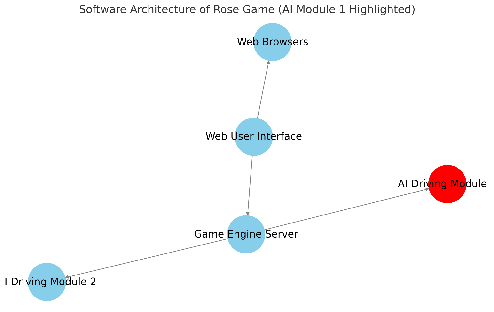

# rose-game-ai-reference
[ROSE game](https://github.com/RedHat-Israel/ROSE) example of a machine learining self driving car module.

This is a reference implementation of a self driving modules for the ROSE game.

This example uses machine learning algorithms, and requires [pytorch](https://pytorch.org/) when running locally.

<p align="center">
  
</p>

ROSE project: https://github.com/RedHat-Israel/ROSE

ROSE self driving car module template: https://github.com/RedHat-Israel/rose-game-ai

## Requirements

 Requires | Version | |
----------|---------| ---- |
 Podman (or Docker) | >= 4.8 | For running containerized |
 Python   | >= 3.9  | For running the code loally |

## ROSE game components

Component | Reference |
----------|-----------|
Game engine | https://github.com/RedHat-Israel/rose-game-engine |
Game web based user interface | https://github.com/RedHat-Israel/rose-game-web-ui |
Self driving car module | https://github.com/RedHat-Israel/rose-game-ai |
Self driving car module example | https://github.com/RedHat-Israel/rose-game-ai-reference |

## Running a self driving module reference example

```bash
podman run --rm --network host -it quay.io/rose/rose-game-ai-reference:latest
```

## Running a self driving module locally

Clone this repository, and make sure you have a game engine running.

Install requirements:

```bash
# Install requirements
pip install -r requirements.txt
pip install -r requirements-dev.txt
```

Write your own driving module, you can use the file `mydriver.py`:

```bash
vi mydriver.py
```

Run using `mydriver.py` as the driving module:

```bash
python main.py --driver mydriver.py
```

## Running ROSE game components containerized

### Running the game engine ( on http://127.0.0.1:8880 )

``` bash
podman run --rm --network host -it quay.io/rose/rose-game-engine:latest
```

### Running the game web based user interface ( on http://127.0.0.1:8080 )

``` bash
podman run --rm --network host -it quay.io/rose/rose-game-web-ui:latest
```

### Running community contributed driver ( on http://127.0.0.1:8082 )

You can use community drivers to compare and evaluate your driver during the development process.

``` bash
podman run --rm --network host -it quay.io/yaacov/rose-go-driver:latest --port 8082
```

### Running your self driving module, requires a local `mydriver.py` file with your driving module. ( on http://127.0.0.1:8081 )

``` bash
# NOTE: will mount mydriver.py from local directory into the container file system
podman run --rm --network host -it \
  -v $(pwd)/:/driver:z \
  -e DRIVER=/driver/mydriver.py \\
  -e PORT=8081 \
  quay.io/rose/rose-game-ai-reference:latest
```

### Testing your driver

Send `car` and `track` information by uring `POST` request to your driver ( running on http://127.0.0.1:8081 ):

``` bash
curl -X POST -H "Content-Type: application/json" -d '{
            "info": {
                "car": {
                    "x": 3,
                    "y": 8
                }
            },
            "track": [
                ["", "", "bike", "", "", ""],
                ["", "crack", "", "", "trash", ""],
                ["", "", "penguin", "", "", "water"],
                ["", "water", "", "trash", "", ""],
                ["barrier", "", "", "", "bike", ""],
                ["", "", "trash", "", "", ""],
                ["", "crack", "", "", "", "bike"],
                ["", "", "", "penguin", "water", ""],
                ["", "", "bike", "", "", ""]
            ]
        }' http://localhost:8081/
```

The response in `JSON` format should include the car name and the recommended action:

``` json
{
  "info": {
    "name": "Go Cart",
    "action": "pickup"
  }
}
```
